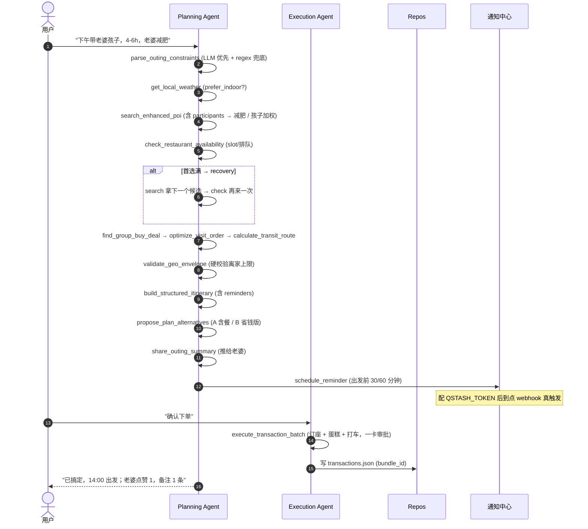

# Local-Life Outing Agent · 设计文档

> 赛题：本地生活短时活动规划与执行 · 周末半日行（2-6 小时）
> 目标：自然语言一句话 → 结构化计划 → 一键完成预订/送达/分享。

## 1 · 一句话定位

**两个 Agent + 25 个工具**，把"周末和家人/朋友半日行"从"想去玩"压缩到"小明已搞定一切，等老婆点 👍"。
规划侧只读不写、执行侧只写不搜，**用户始终在同一会话**里说话。

---

## 2 · 系统架构

```mermaid
flowchart LR
  U([User<br/>"下午带老婆孩子出去玩"])
  Router{{Router<br/>execute keyword<br/>判定}}
  P[Planning Agent<br/>21 tools, maxSteps=16]
  E[Execution Agent<br/>9 tools, maxSteps=12]
  Mem[(Mastra Memory<br/>+ LibSQL<br/>thread / resource)]
  QStash[(QStash<br/>Reminder Job)]
  Notif[(Notifications<br/>Mock 通知中心)]
  Repos[(JSON Repos<br/>plans / txns / share / notif)]

  U -->|chat| Router
  Router -->|"想去玩 / 比一比"| P
  Router -->|"确认下单 / 直接付"| E
  P <--> Mem
  E <--> Mem
  P -->|schedule_reminder| QStash
  QStash -.->|webhook| Notif
  E -->|execute_transaction_batch| Repos
  P -->|build_structured_itinerary| Repos
```

### 2.1 关键设计决策

| 决策 | 取舍 | 备注 |
| --- | --- | --- |
| **Two Agents** 而非 single | 限制权限边界，让规划侧不能下单、执行侧不能瞎搜 | router 在 `pickChatAgent` 里靠关键词切换 |
| **Mastra Memory + LibSQL** | 跨会话召回 + 持久化（同邮箱再来能拿回上次行程） | `.data/memory.db` → 上线换 `LIBSQL_URL=libsql://...` |
| **Repository Pattern** | plan / transaction / notification / share 全部 JSON 文件，可一行换 SQL | `src/infra/repos/` 接口层 + `json/` 实现层 |
| **要求人审批 = batch 一卡** | `execute_transaction_batch` 配 `requireApproval` —— 一张 glassmorphism 卡片显示 N 笔 + 总价 + 一个按钮 | 见 `components/chat/tools/execute-transaction-batch-tool-ui.tsx` |
| **Prompt 缓存** | Gemini Flash 隐式前缀缓存（auto，≥1024 tokens 自动） | `lib/llm/prompt-cache.ts` 在启动时 log 状态 |
| **provider-aware** | 不同 LLM 用不同缓存策略：Anthropic 走 cache_control，OpenAI 隐式 | 避免锁死单一模型 |

---

## 3 · 主链路：从用户一句话到一键搞定



---

## 4 · 工具清单（按层）

| 层 | Tool ID | 作用 | 关键参数 / Side effect |
| --- | --- | --- | --- |
| meta | `load_outing_skill` | 按需载入策略片段 | fragments：domain / examples / tool_routing / forbidden / execution_boundaries |
| meta | `write_outing_todos` | 多步任务前写计划快照 | 单条 in_progress |
| meta | `compact_session_context` | 上下文压缩 | focus 可指定保留主题 |
| meta | `run_planning_subtask` | 子 Agent 干净上下文跑探路 | 不能再嵌套 |
| nlu | `parse_outing_constraints` | LLM 抽 scene / participants / dietary / window | 兜底 regex |
| discover | `search_enhanced_poi` | POI 候选 + 综合评分 0-100 | 接 Amap 时优先用真实 POI；participants → kid/low_cal/group 加权 |
| discover | `get_local_weather` | adcode + date → 雨天 prefer_indoor | 接高德 weather/all（fallback mock） |
| discover | `check_restaurant_availability` | slot 列表 + 排队 ETA | env `OUTING_BUSY_POI_IDS` 可强模拟爆满，演示自动切备选 |
| discover | `find_group_buy_deal` | POI 团购套餐 | 输出 coupon_code_for_apply |
| routing | `calculate_transit_matrix` | N×N 距离矩阵 | 接 Amap distance_matrix |
| routing | `calculate_transit_route` | 顺序点串路线 | 含返家 origin |
| routing | `optimize_visit_order` | 含 home 起点排序 | 贪心 nearest-neighbor |
| routing | `validate_geo_envelope` | 离家上限硬校验 | feasible / violations |
| constraints | `validate_timeline_feasibility` | 段间冲突检测 | 共享纯 domain `assertTimelineFeasible` |
| authoring | `build_structured_itinerary` | 段时间轴 + 预算汇总 + reminders | budget_total_cny 红线，超会拒绝 |
| authoring | `propose_plan_alternatives` | A/B/C 选项卡 | 自动选 cost 最低 ≥ 2 段为推荐 |
| authoring | `share_outing_summary` | 生成只读链接 | wechat_mock / sms_mock / link_only |
| follow-up | `schedule_reminder` | 写通知中心 + QStash 调度 | delivery: mock_only / qstash_scheduled |
| follow-up | `fetch_share_feedback` | 拉 share 反馈聚合 | 含点赞数 / 评论 |
| execution | `execute_transaction` | 单笔 mock 下单 | requireApproval（人审） |
| execution | `execute_transaction_batch` | **多笔一键编排（一卡审批）** | bundle_id；走 mock 计费 + coupon 抵扣 |
| execution | `modify_reservation` | 取消旧+下新 原子 | 双 idempotency_key |
| execution | `book_taxi` / `apply_coupon` / `mock_pay_via_meituan_wallet` | 打车 / 校验券 / 钱包付 | 全 mock |

---

## 5 · 异常处理矩阵

| 触发条件 | 检测点 | 自动恢复策略 | 兜底 / 用户可见 |
| --- | --- | --- | --- |
| LLM 没抽到 scene/duration/budget | `parse_outing_constraints` | regex 兜底 + baseline 填充 | `overridden_fields` 透出，UI 标"已默认填充" |
| 离家超 max_travel_km | `validate_geo_envelope` | 替换 POI 或缩小候选池重排 | violations 数组带 POI 列表 |
| 时间轴段重叠 | `assertTimelineFeasible` | 抛 `TIMELINE_INFEASIBLE`，agent 调整 segment | 工具拒绝定稿，agent 必须改 |
| 总预算超红线 | `build_structured_itinerary` | 抛 `BUDGET_EXCEEDED`，agent 换更便宜 POI 或减段 | demo 给 1.6× cushion 防卡死 |
| 餐厅全时段满 | `check_restaurant_availability` (`recommended_slot_id` 缺) | 回 search → 取下一个候选 → 再 check | UI 卡片显示「X 满了，已切备选 Y」 |
| 雨天/雷暴 | `get_local_weather` `prefer_indoor=true` | 强制 search 加 `prefer_indoor=true`；prompt 规则 13 强调 | 主动告知"换室内" |
| 多 POI 路径不可解 | `calculate_transit_route` | 移除最远 POI 或要求用户放宽 max_travel_km | error message 含建议 |
| QStash 未配 / 网络挂 | `scheduleReminderViaQstash` | 仍写 mock 通知中心，`delivery=mock_only` | 用户体感无差，铃铛仍能收到 |
| 用户拒绝 batch 审批 | `execute_transaction_batch` resume 返 `approved=false` | agent 不得继续编排 | 提示用户重新规划 |
| 工具调用 throw | Mastra runtime | agent 重试 / 调整参数 | 失败 ≥ 2 次后让用户决策 |

---

## 6 · 可观测 / 持久化 / 多用户

- **Memory（thread + resource）**：每次 chat POST 把 `auth() → user.email` 解析成 resourceId，threadId 取 chat session id。同一邮箱跨 thread 仍能共享 observational memory（当前 `semanticRecall=false`，需要时再开 vector）。
- **LibSQL**：`.data/memory.db`（开发），`LIBSQL_URL=libsql://...` + `LIBSQL_AUTH_TOKEN`（生产 Turso）。同时给 `Mastra` 和 `Memory` 用，避免双写。
- **Prompt cache 状态**：`prompts/load.ts` 在 boot 时 log，例如 `[prompt-cache] planning-agent ~3500 tokens → Gemini implicit prefix cache (auto when prefix stable & >= 1024 tokens)`。
- **JSON Repos** 都在 `.data/`：`plans.json` / `transactions.json` / `notifications.json` / `share-feedback.json`，前端 `/plans` / `/transactions` 页面直接读。

---

## 7 · 演示剧本（4 条 CLI 入口）

| 命令 | 演示什么 |
| --- | --- |
| `npm run demo:family` | 主链路：parse → weather → search → 订座 → 团购 → 时间轴 → A/B → share → 老婆点赞 → fetch 反馈 → 一键 batch（订座 + 蛋糕） |
| `npm run demo:friends` | 4 人朋友局；先逛展再吃饭，验证 group_friendly + budget 1.6× cushion |
| `npm run demo:busy` | 首选餐厅强模拟爆满 → 自动切备选 `本帮家宴`，体现 5.1 异常恢复 |
| `npm run demo:revisit` | 第一次写 thread metadata → 重置 Memory 单例 → 仅凭 resourceId 召回，证明 LibSQL 跨进程持久 |

> 真正的 LLM 链路在 `npm run dev` 后通过 Web UI 体验，CLI 只跑工具来证明逻辑正确性。
